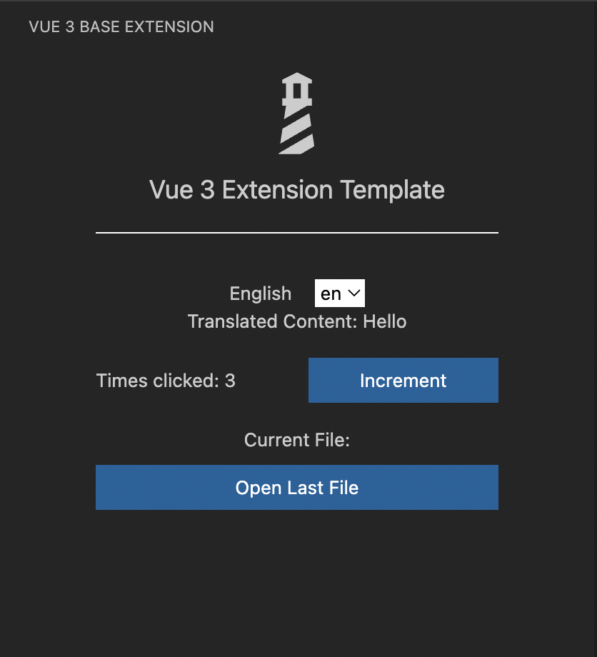

<!--
 * @FilePath: /AutoAPIGen/DESC.md
 * @Description:
-->

# Base Vue 3 侧边栏视图扩展

```html
<p align="center">
  
</p>
```

Vue 3、Vite 构建的模板可用于创建 VSCode 侧边栏扩展，通过提供结构化代码并利用 vite 构建工具来编译和打包扩展，以便部署到 VSCode。此模板包含您立即开始构建扩展所需的一切。通过这个模板，您可以利用 Vue 3 的特性和功能，为 VSCode 构建强大且交互式的扩展。

## 包含内容

- [x] Typescript
- [x] Vue 3
- [x] Vite
- [x] Tailwindcss
  - [x] Vscode Default style Tailwind config
- [x] Iconify via unplugin
- [x] I18n via unplugin
- [x] Vitest
  - [x] Vitest UI
- [x] Testing Library
- [x] Decent Linting
- [x] CircleCI
- [x] Basic VSCode API Message Examples

## 开始使用

安装依赖项：

- `yarn install`

修改以下文件：

- `package.json`
  - 将所有 `AutoAPIGen` 替换为您的扩展 ID
  - 将所有 `AutoAPIGen` 替换为视图 ID
  - 将所有 `Auto API Gen Extension` 替换为扩展名称
  - 将 `default.png` 替换为您自己的扩展图标

运行扩展：

- 在控制台中输入 `yarn watch`

- 在 `extension.ts` 上按 `f5` 打开调试窗口（或选择菜单中的“调试”->“运行扩展”）

- 导航到左侧侧边栏上看到的扩展图标（或打开命令面板（`Ctrl/Cmd + Shift + P`）并选择 `View: Vue 3 Base Extension` 以打开 webview 视图。）

## 推荐的 VSCode 扩展

- [Vitest](https://marketplace.visualstudio.com/items?itemName=ZixuanChen.vitest-explorer)

- [Volar](https://marketplace.visualstudio.com/items?itemName=Vue.volar)

- [I18n A11y](https://marketplace.visualstudio.com/items?itemName=Lokalise.i18n-ally)

- [Iconify Intellisense](https://marketplace.visualstudio.com/items?itemName=antfu.iconify)

## 参考资料

- [Webviews](https://code.visualstudio.com/api/extension-guides/webview)

- [UX 指南](https://code.visualstudio.com/api/ux-guidelines/overview)

- [Webview 视图 API](https://code.visualstudio.com/api/references/vscode-api#WebviewView)

- [主题指南](https://code.visualstudio.com/api/references/theme-color)

